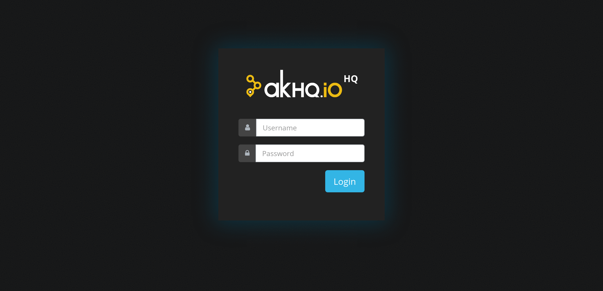

# AKHQ (previously known as KafkaHQ)

> Kafka GUI for [Apache Kafka](http://kafka.apache.org/) to manage topics, topics data, consumers group, schema registry, connect and more...

    
  

## Documentation
* The official AKHQ documentation can be found under: [akhq.io](https://akhq.io/docs)

## Sponsors
<table>
<tr>
<td>
  
    

<h3>Upstash: Serverless Kafka</h3>

  <ul>
    <li>True Serverless Kafka with per-request-pricing</li>
    <li>Managed Apache Kafka, works with all Kafka clients</li>
    <li>Built-in REST API designed for serverless and edge functions</li>
  </ul>

[Start for free in 30 seconds!](https://upstash.com/?utm_source=AKHQ)
</td>
</tr>
</table>

## From AKHQ project creator
<table>
<tr>
<td>
  
    

<h3>Kestra: Open source data orchestration and scheduling platform</h3>

Kestra is an infinitely scalable orchestration and scheduling platform, creating, running, scheduling, and monitoring millions of complex pipelines.

[Discover the project!](https://github.com/kestra-io/kestra?utm_source=AKHQ)
</td>
</tr>
</table>

## Who's using AKHQ
* [Adeo](https://www.adeo.com/)
* [Avlino](https://avlino.com/)
* [Auchan Retail](https://www.auchan-retail.com/)
* [BARMER](https://www.barmer.de/)
* [Bell](https://www.bell.ca)
* [Best buy](https://www.bestbuy.com)
* [BMW Group](https://www.bmwgroup.com)
* [Boulanger](https://www.boulanger.com/)
* [BPCE-IT](https://www.bpce-it.fr/)
* [Decathlon](https://www.decathlon.fr/)
* [Depop](https://www.depop.com)
* [Fresha](https://www.fresha.com/)
* [Galeries Lafayette](https://www.galerieslafayette.com/)
* [GetYourGuide](https://www.getyourguide.com)
* [Kitopi](https://kitopi.com)
* [Klarna](https://www.klarna.com)
* [La Redoute](https://laredoute.io/)
* [Leroy Merlin](https://www.leroymerlin.fr/)
* [NEXT Technologies](https://www.nextapp.co/)
* [Nuxeo](https://www.nuxeo.com/)
* [Pipedrive](https://www.pipedrive.com)
* [TUI](https://www.tui.com)
* [TVG](https://www.tvg.com)
* [Vodeno](https://www.vodeno.com/)

## Credits

Many thanks to:

* [JetBrains](https://www.jetbrains.com/?from=AKHQ) for their free OpenSource license.
* Apache, Apache Kafka, Kafka, and associated open source project names are trademarks of the Apache Software Foundation. AKHQ is not affiliated with, endorsed by, or otherwise associated with the Apache Software.

## License
Apache 2.0 © [tchiotludo](https://github.com/tchiotludo)
